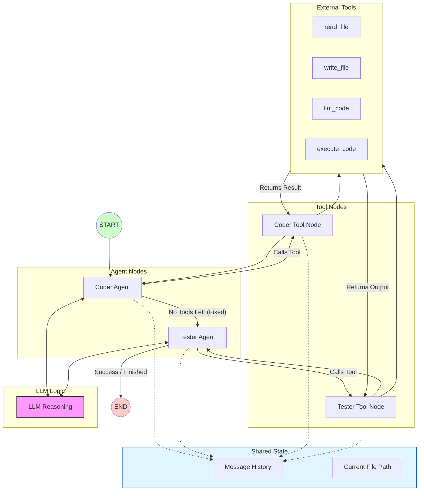

# Local-Code-Agent Architect

An autonomous, stateful multi-agent system built with **LangGraph** and **Ollama** that researches, fixes, lints, and verifies code locally. 

This project demonstrates how small local models (like Qwen 3.5 2B or Llama 3 8B) can be orchestrated to handle complex, multi-step engineering tasks through a feedback loop.

## Features
- **Stateful Orchestration**: Uses LangGraph to maintain a persistent "memory" of the debugging process.
- **Self-Healing Loop**: If the agent writes code with syntax errors, the **Linter** catches it and the agent fixes itself.
- **Automated Verification**: A dedicated **Tester Agent** executes the code in a subprocess to ensure the logic actually works.
- **100% Local & Free**: Runs entirely on your hardware using Ollama—no API keys or costs required.

The system uses a directed cyclic graph (DAG) to manage the workflow:
1. **Coder Node**: Analyzes the bug and writes a solution.
2. **Linting Tool**: Checks for syntax errors (e.g., missing colons, indentation).
3. **Tester Node**: Inherits the state and attempts to execute the code.
4. **Execution Tool**: Returns real terminal output/errors back to the agents for further refinement.

## The Architecture

The system follows a Directed Cyclic Graph (DCG) pattern where agents pass the state through specialized tool nodes until the task is verified as complete.



## Project Structure
```text
.
├── agents/
│   ├── coder.py         # Logic for the Coder & Tester agents
├── tools/
│   ├── file_tools.py    # Custom tools: read, write, lint, execute
├── workspace/           # The sandbox where the agents work
│   └── src/
│       └── app.py       # Target file for the agents to fix
├── state.py             # LangGraph TypedDict state definition
└── main.py              # The Graph orchestrator and entry point
```

## Setup & Usage

### Prerequisites
- [Ollama](https://ollama.com/) installed and running.
- Python 3.10+

### Installation
1. Clone this repository.
2. Install dependencies:
   ```bash
   pip install langgraph langchain_ollama langchain_core
   ```
3. Pull the local model:
   ```bash
   ollama pull qwen3.5:2b  # or llama3 / qwen3.5:2b
   ```

### Running the System
Place your "buggy" code in `workspace/src/app.py` and run:
```bash
python main.py
```

## Example Trace
- **Coder**: Identified division by zero error in `app.py`.
- **Tools**: `write_file` called.
- **Linter**: `Syntax Error: expected ':'`.
- **Coder**: Corrected syntax and re-wrote file.
- **Tester**: `execute_code` called. 
- **Result**: `Success! Output: 0`.


---
