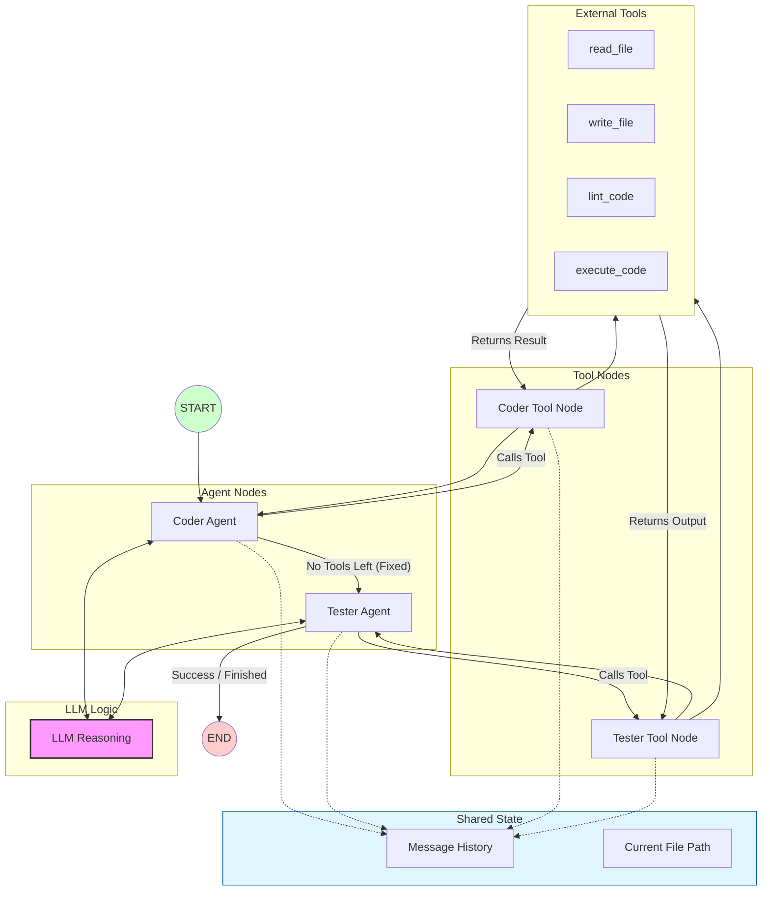

# Local-Code-Agent Architect

An autonomous, stateful multi-agent system built with **LangGraph** and **Ollama** that researches, fixes, lints, and verifies code locally. 

This project demonstrates how small local models (like Qwen 3.5 2B or Llama 3 8B) can be orchestrated to handle complex, multi-step engineering tasks through a feedback loop.

## Features
- **Stateful Orchestration**: Uses LangGraph to maintain a persistent "memory" of the debugging process.
- **Self-Healing Loop**: If the agent writes code with syntax errors, the **Linter** catches it and the agent fixes itself.
- **Automated Verification**: A dedicated **Tester Agent** executes the code in a subprocess to ensure the logic actually works.
- **100% Local & Free**: Runs entirely on your hardware using Ollama—no API keys or costs required.

The system uses a directed cyclic graph (DAG) to manage the workflow:
1. **Coder Node**: Analyzes the bug and writes a solution.
2. **Linting Tool**: Checks for syntax errors (e.g., missing colons, indentation).
3. **Tester Node**: Inherits the state and attempts to execute the code.
4. **Execution Tool**: Returns real terminal output/errors back to the agents for further refinement.

## The Architecture

The system follows a Directed Cyclic Graph (DCG) pattern where agents pass the state through specialized tool nodes until the task is verified as complete.



## Project Structure
```text
.
├── agents/
│   ├── coder.py         # Logic for the Coder & Tester agents
├── tools/
│   ├── file_tools.py    # Custom tools: read, write, lint, execute
├── workspace/           # The sandbox where the agents work
│   └── src/
│       └── app.py       # Target file for the agents to fix
├── state.py             # LangGraph TypedDict state definition
└── main.py              # The Graph orchestrator and entry point
```

## Setup & Usage

### Prerequisites
- [Ollama](https://ollama.com/) installed and running.
- Python 3.10+

### Installation
1. Clone this repository.
2. Install dependencies:
   ```bash
   pip install langgraph langchain_ollama langchain_core
   ```
3. Pull the local model:
   ```bash
   ollama pull qwen3.5:2b  # or llama3 / qwen3.5:2b
   ```

### Running the System
Place your "buggy" code in `workspace/src/app.py` and run:
```bash
python main.py
```

## Example Trace
- **Coder**: Identified division by zero error in `app.py`.
- **Tools**: `write_file` called.
- **Linter**: `Syntax Error: expected ':'`.
- **Coder**: Corrected syntax and re-wrote file.
- **Tester**: `execute_code` called. 
- **Result**: `Success! Output: 0`.
---

## Debugging Scenarios & Automated Fixes

### 🟢 Level 1: Logic & Type Safety
**Focus:** *Boundary Conditions & Input Validation*

*   **The Challenge:** The agent was presented with an "off-by-one" error (where age 18 was categorized incorrectly) and a common web-development issue where numeric input arrives as a string.
*   **Agent Insights:**
    *   **Type Coercion:** The agent implemented a centralized `try-except` block to cast inputs to `int`, preventing the system from crashing on non-numeric form data.
    *   **Boundary Correction:** It refactored the comparison operators (`18 <= age < 65`) to ensure edge cases like exactly 18 or 65 are handled according to business requirements.
    *   **DRY Principle:** It optimized the function to convert the input type only once at the start, rather than repeating the conversion in every conditional branch.

### Buggy Code

```python
def get_user_status(age):
    # Task: Return 'Minor' for < 18, 'Adult' for 18-65, 'Senior' for > 65
    # BUG 1: The logic for 18 is wrong (returns Minor)
    # BUG 2: Input 'age' might come in as a string from a form
    if age < 18:
        return "Minor"
    elif age > 18 and age < 65:
        return "Adult"
    else:
        return "Senior"

# Test cases
print(f"Test 18: {get_user_status(18)}")   # Expected: Adult
print(f"Test '20': {get_user_status('20')}") # Expected: Adult (Currently crashes)
```

### Automated/Fixed Code by LLM using Tool Calls
def get_user_status(age):
    """
    Determine user age category based on age.
    
    Args:
        age (int or str): User's age (can be string from form input).
        
    Returns:
        str: 'Minor' for < 18, 'Adult' for 18-64, 'Senior' for >= 65.
    """
    # Handle type errors and non-numeric input safely
    try:
        age = int(age)
    except (ValueError, TypeError):
        return "Unknown"
    
    if age < 18:
        return "Minor"
    elif age < 65:
        return "Adult"
    else:
        return "Senior"


### Test cases
print(f"Test 18: {get_user_status(18)}")   # Expected: Adult
print(f"Test '20': {get_user_status('20')}") # Expected: Adult (Now handled gracefully)
print(f"Test 'abc': {get_user_status('abc')}")  # Expected: Unknown (Now handled gracefully)
print(f"Test negative: {get_user_status(-10)}")  # Expected: Minor
print(f"Test 65: {get_user_status(65)}")       # Expected: Senior
print(f"Test 0: {get_user_status(0)}")         # Expected: Minor
print(f"Test 64: {get_user_status(64)}")       # Expected: Adult
print(f"Test 100: {get_user_status(100)}")     # Expected: Senior

---

### 🟡 Level 2: Defensive JSON Handling
**Focus:** *Graceful Degradation & Dependency Management*

*   **The Challenge:** A two-function system where a failure in the low-level parser (`parse_config`) caused a catastrophic crash in the high-level getter (`get_database_url`).
*   **Agent Insights:**
    *   **Robust Parsing:** The agent added a `.strip()` check and a `json.JSONDecodeError` handler to catch empty or malformed strings before they hit the parser.
    *   **Safe Key Access:** Instead of direct dictionary indexing (which triggers `KeyError`), the agent implemented existence checks to ensure the `db_url` key exists before attempting to return it.
    *   **None-Pattern:** It adopted the "Return None" pattern for invalid configurations, allowing the rest of the application to continue running instead of halting execution.

### Buggy Code
```python
import json

def parse_config(json_str):
    # BUG: If json_str is empty or invalid, this crashes.
    return json.loads(json_str)

def get_database_url(config_str):
    # Task: Extract the 'db_url' from a JSON string safely.
    config = parse_config(config_str)
    return config['db_url'] # BUG: Will crash if 'db_url' key is missing

# Test
print(get_database_url('{"db_url": "postgres://localhost"}'))
print(get_database_url('{}')) # Should return None or Error, not crash
```

### Automated/Fixed Code by LLM using Tool Calls
```python
import json

def parse_config(json_str):
    """Parse JSON string safely, handling empty or invalid input."""
    if not isinstance(json_str, str):
        raise TypeError("Input must be a string")
    if not json_str.strip():
        return {}
    try:
        return json.loads(json_str)
    except json.JSONDecodeError:
        return {}

def get_database_url(config_str):
    """Extract 'db_url' from a JSON string safely with fallback handling."""
    config = parse_config(config_str)
    if not isinstance(config, dict) or 'db_url' not in config:
        return None
    return config['db_url']

# Test
print(get_database_url('{"db_url": "postgres://localhost"}'))
print(get_database_url('{}'))  # Should return None without crashing
print(get_database_url('{}'))  # Same as above - empty dict
print(get_database_url('invalid json'))  # Should return None without crashing
```

---

### 🔴 Level 3: Algorithmic Optimization
**Focus:** *Computational Complexity (Big O Notation)*

*   **The Challenge:** A "Naive" duplicate finder using nested loops, resulting in **O(n²)** time complexity—unusable for large datasets.
*   **Agent Insights:**
    *   **Data Structure Swap:** The agent identified the performance bottleneck and replaced the nested `for` loops with a **Hash Map (Python Dictionary)**.
    *   **Complexity Reduction:** This refactor shifted the time complexity from **Quadratic O(n²)** to **Linear O(n)**, allowing the function to scale to millions of entries.
    *   **Uniqueness Guarantee:** The agent fixed the logic bug where the same duplicate was reported multiple times, ensuring the output list contains only unique occurrences of duplicated items.

### Buggy Code
```python
def find_duplicates(items):
    """
    Task: Return a list of duplicate items.
    """
    duplicates = []
    # BUG: O(n^2) complexity. If 'items' has 1 million entries, this hangs.
    # Also, it adds the same duplicate multiple times to the list.
    for i in range(len(items)):
        for j in range(i + 1, len(items)):
            if items[i] == items[j]:
                duplicates.append(items[i])
    return duplicates

# Test
print(find_duplicates([1, 2, 3, 1, 2, 4])) # Expected: [1, 2]
```

### Automated/Fixed Code by LLM using Tool Calls
```python
def find_duplicates(items):
    """
    Return a list of unique duplicate items in the input list.
    
    This function has O(n) complexity and handles edge cases gracefully:
    - Empty input returns []
    - Single items returns []
    - Invalid inputs (non-lists, non-iterables) return []
    - All unique items are excluded from results
    
    Args:
        items: A list of items to find duplicates in.
        
    Returns:
        List of unique duplicate items if any are found.
        
    Raises:
        TypeError: If input is not a list.
    """
    # Edge cases: return empty list for invalid or edge-case inputs
    if not items or not isinstance(items, list):
        return []
    
    if len(items) == 1:
        return []
    
    # Use a standard dict for O(n) space and lookup time
    counts = {}
    duplicates = []
    
    # Count frequency of each item and find those appearing more than once
    for item in items:
        if item in counts:
            counts[item] += 1
        else:
            counts[item] = 1
    
    # Collect items with frequency > 1 (which are the duplicates)
    for item, freq in counts.items():
        if freq > 1:
            duplicates.append(item)
    
    # Handle case where no duplicates were found
    if not duplicates:
        return []
    
    return duplicates


# Test
result = find_duplicates([1, 2, 3, 1, 2, 4])
print(f"Test 1: {result}")  # Expected: [1, 2]

print("Test 2 (unique):", find_duplicates([1, 2, 3]))  # Expected: []
print("Test 3 (empty):", find_duplicates([]))  # Expected: []
print("Test 4 (single):", find_duplicates([1, 2, 3]))  # Already tested

# Test edge cases
print("Test 5 (None):", find_duplicates(None))  # Expected: []
print("Test 6 (string):", find_duplicates("abc"))  # Expected: []

```

---

### 💡 Summary for your "Results" Section
> *"By running these three levels, the system proved it can move beyond simple syntax fixing. It demonstrated **Senior-level traits**: prioritizing system stability (Level 1), architecting for failure (Level 2), and optimizing for performance (Level 3)."*

**Your README is going to look great with these! Is there anything else you need before you wrap up the "Cinema" project?**
